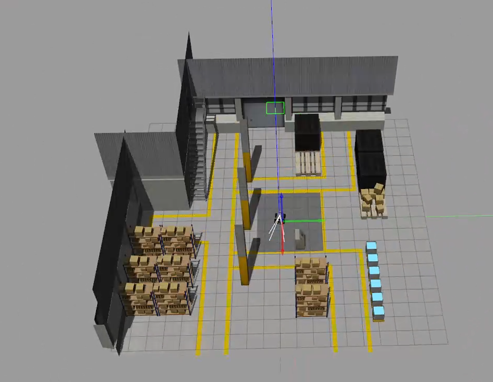
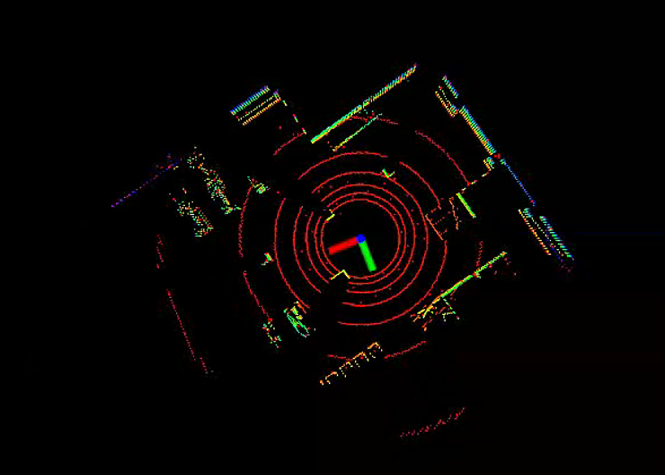
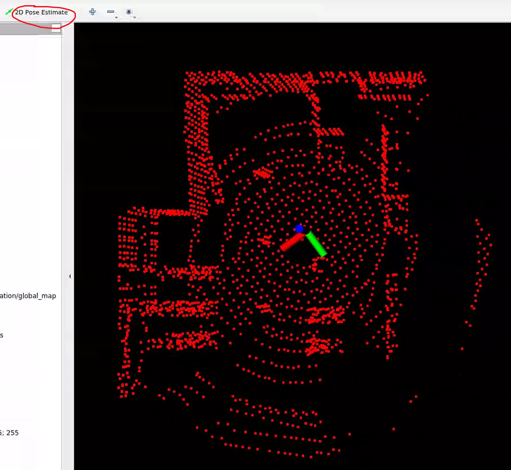
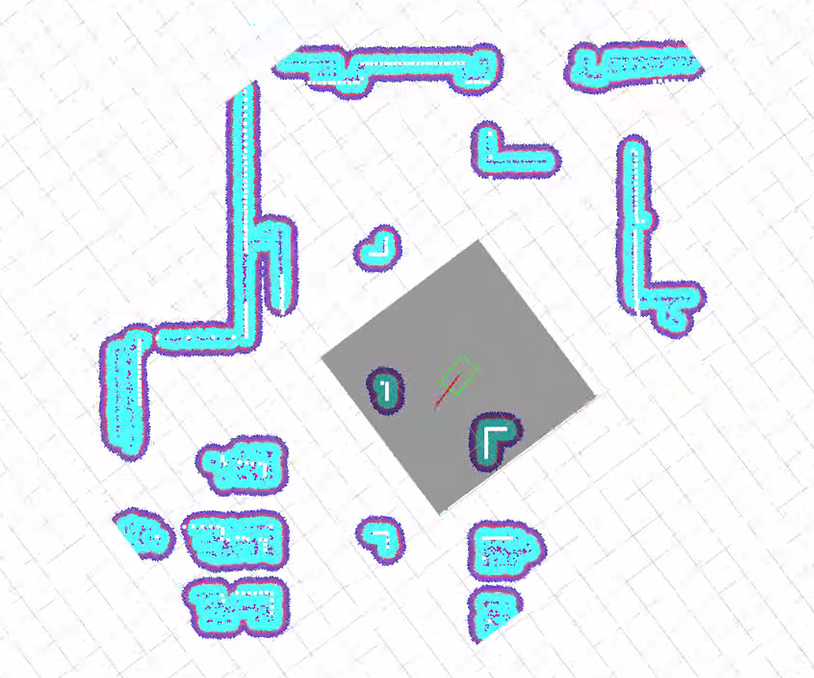

# 介绍

将lio-sam作为里程计，在move_base中实现2D导航。


# 预装库版本

- ros-noetic
- move_base
- gtsam


# 如何编译

```bash
catkin_make
echo "source ${project_root}/devel/setup.bash" >> ~/.bashrc
```


# 如何使用

1打开gazebo仿真

```bash
roslaunch warehouse_simulation warehouse_simulation.launch
```



2使用liorf进行建图

```bash
roslaunch liorf run_lio_sam_default.launch
```



3保存点云地图，自定义路径，下面只是例子，需要修改

```bash
rosservice call /liorf/save_map 0.2 "/LIO-SAM/map"
```

4使用liorl进行重定位，并将/liorl/deskew/cloud_deskewed话题实时转换为scan（用于move_base中的话题输入），激光里程计也将作为move_base的定位源。

```bash
roslaunch liorl run_liorl.launch
```

5点击rviz中的2D Pose Estimate，给一个初始的位姿估计，用于ICP点云配准



6 运行pcd2pgm package，将点云地图转为2D map，用作move_base中的global map。

```
roslaunch pcd2pgm run.launch
```

ps:记得修改包含pcd文件夹的目录。

7 运行move_base，点击2D Nav Goal发布目标点，可实现自动导航。

```bash
roslaunch move_base_benchmark move_base_benchmark.launch
```



关键参数

costmap_common_params-footprint: 车体的大小

local_costmap_params-update_frequency: 局部路径更新频率

local_costmap_params-publish_frequency:局部路径发布频率


# 代码链接
https://yunshitu.coding.net/p/navigation_and_planning/d/lio_sam_move_base_tutorial/git

# 参考

https://github.com/linzs-online/robot_gazebo

https://github.com/wh200720041/warehouse_simulation_toolkit

https://github.com/YJZLuckyBoy/liorf

https://github.com/YJZLuckyBoy/liorf_localization
